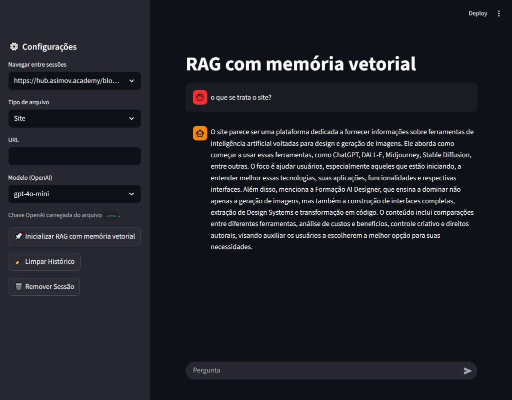

# RAG com memória vetorial

Aplicação web em que você **carrega uma fonte de informação** (site, PDF, planilha ou texto) e **conversa em linguagem natural** com um assistente que responde com base nesse material — sem inventar fora do que foi indexado.



*Exemplo real: pergunta “o que se trata o site?” sobre uma URL indexada; a resposta resume o tema do site usando o conteúdo carregado.*

---

## Por que isso importa?

Em muitos cenários não basta “perguntar para o ChatGPT”: é preciso que as respostas **tenham como base documentos ou páginas específicas** (políticas internas, manuais, sites de produto, relatórios). Este projeto mostra uma forma organizada de fazer isso: **ler a fonte, guardar o conteúdo de modo pesquisável e gerar respostas alinhadas a ele**, com interface simples para quem não é técnico.

## O que dá para fazer

- **Perguntar em português** (ou outro idioma, conforme o modelo) e receber respostas com **streaming** (texto aparecendo aos poucos).
- **Várias fontes:** endereço de site, PDF, CSV ou arquivo de texto.
- **Várias conversas:** trocar entre sessões na barra lateral quando você indexar mais de uma fonte.
- **Controle do chat:** limpar só o histórico da conversa ou remover a sessão (e os dados indexados daquela sessão).
- **Modelos OpenAI** configuráveis na interface (por exemplo `gpt-4o-mini`).

## Tecnologias (visão geral)

| Área | Uso no projeto |
|------|----------------|
| **Python** | Lógica da aplicação |
| **Streamlit** | Interface web rápida de montar |
| **OpenAI** | Modelo de conversa e representação numérica do texto para busca |
| **Chroma** | Armazenamento local do índice para consultas por similaridade |
| **LangChain** | Encaixe entre carregamento de documentos, índice e modelo |

Em uma frase: o texto da sua fonte é **organizado e indexado**; na hora da pergunta, o sistema **busca os trechos mais relevantes** e o modelo **monta a resposta** usando esses trechos e um pouco de histórico de conversa.

## Como rodar no seu computador

1. **Python 3.10+** recomendado.  
2. **Clone o repositório** (ajuste a pasta se o nome for outro):

   ```bash
   git clone https://github.com/vitor-codes/oraculo.git
   cd oraculo
   ```

3. **Instale as dependências** — com `uv` (recomendado no projeto):

   ```bash
   uv sync
   ```

   Ou com pip:

   ```bash
   pip install -r requirements.txt
   ```

4. Crie um arquivo **`.env`** na raiz com sua chave da OpenAI:

   ```
   OPENAI_API_KEY=sua_chave_aqui
   ```

5. **Inicie o app:**

   ```bash
   uv run streamlit run app.py
   ```

   No Windows você também pode usar o `run.bat`, se existir na pasta.

6. No navegador: escolha o tipo de fonte, informe URL ou envie arquivo, clique em **Inicializar RAG com memória vetorial** e use o campo **Pergunta**.

## Boas práticas e limitações

- A **chave da API** não deve ir para o Git; use só `.env` local (o repositório costuma ignorar `.env` e a pasta de índice `chromadb/`).
- **Sites** precisam ser acessíveis publicamente (ou pelo menos da sua rede); páginas muito dinâmicas podem ser difíceis de extrair.
- **Documentos muito grandes** exigem mais tempo e memória na primeira indexação.

## Licença

Projeto de **uso educacional** e portfólio.
